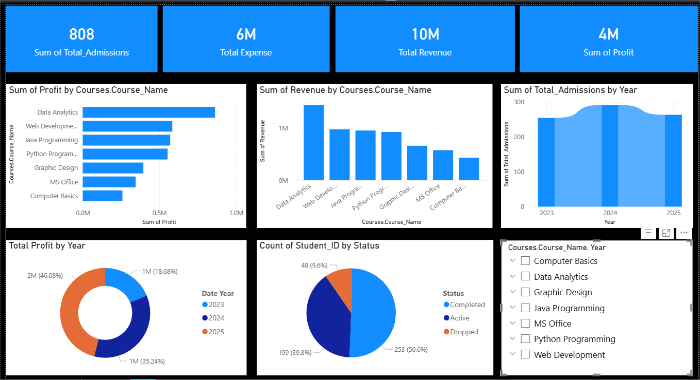

# Computer Institute Business Analysis Performance(Power BI)

## 📊 Project Overview
This Power BI dashboard analyzes the performance of a computer training institute.

It provides insights on:
- Total Admissions
- Revenue, Expense & Profit
- Profit by Course
- Admissions Trend by Year
- Student Status Distribution (Active, Completed, Dropped)

## 🛠 Tools Used
- Power BI
- Data Modeling
- DAX Measures
- Data Relationships

## 📈 Key Insights
- Total Revenue: 10M
- Total Expense: 6M
- Total Profit: 4M
- 808 Total Admissions
- 50%+ Students Completed Courses

## 📷 Dashboard Preview

